**下载**

从 bytom 下载页面可以下载桌面版 dashboard，桌面版 dashboard 下载地址：[https://github.com/Bytom/bytom/releases](https://github.com/Bytom/bytom/releases) 

选择对应的桌面版本点击下载：

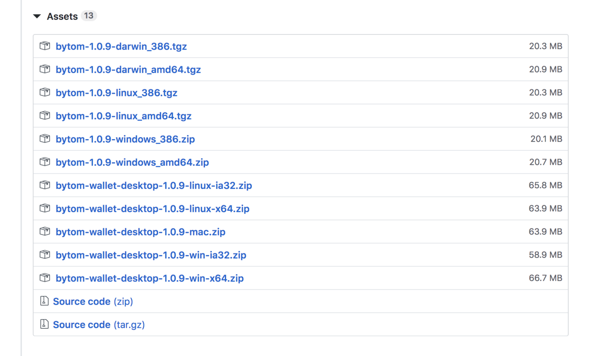

下载完成后点击安装：
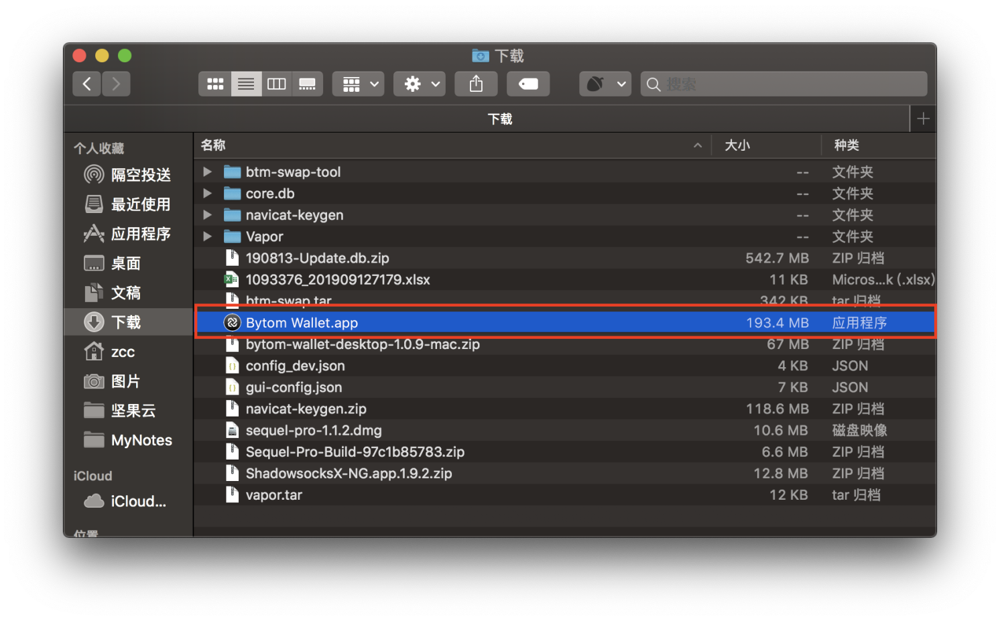
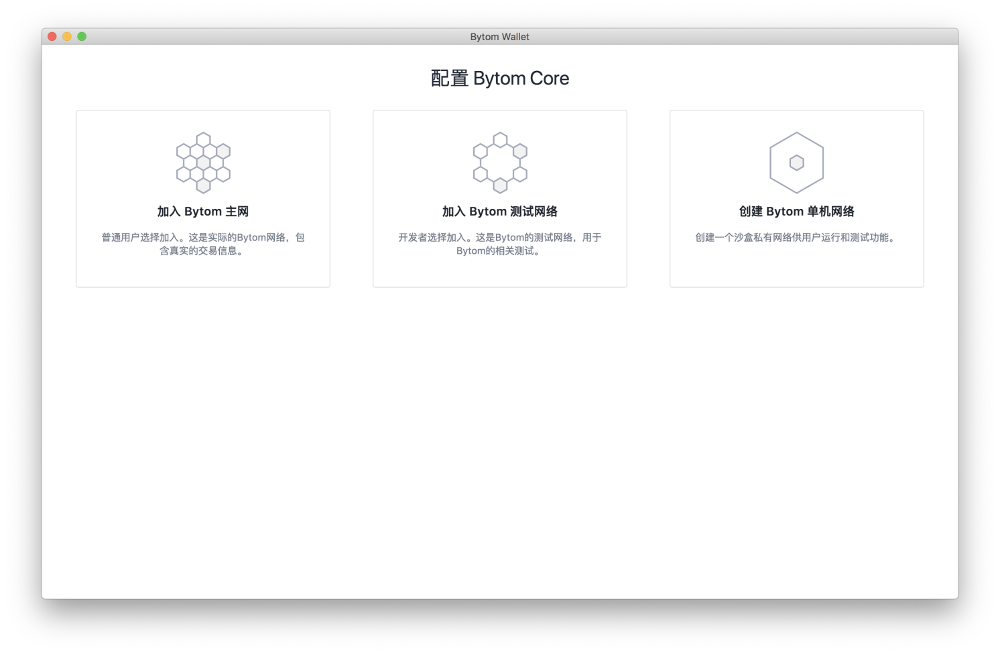

选择一个网络，然后创建初始账户和密钥：
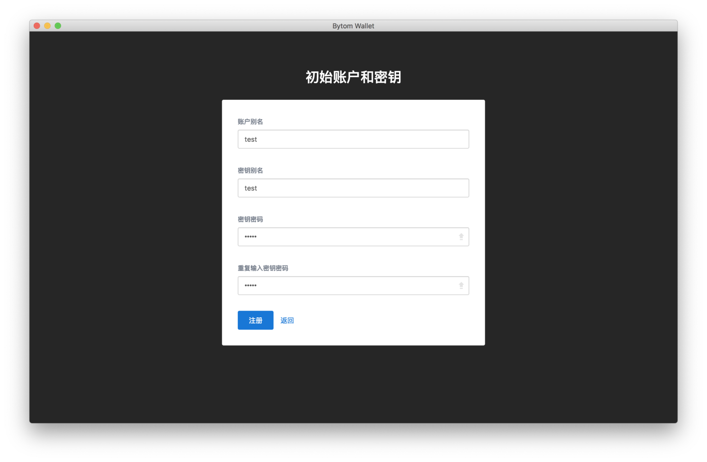

备份助记词：
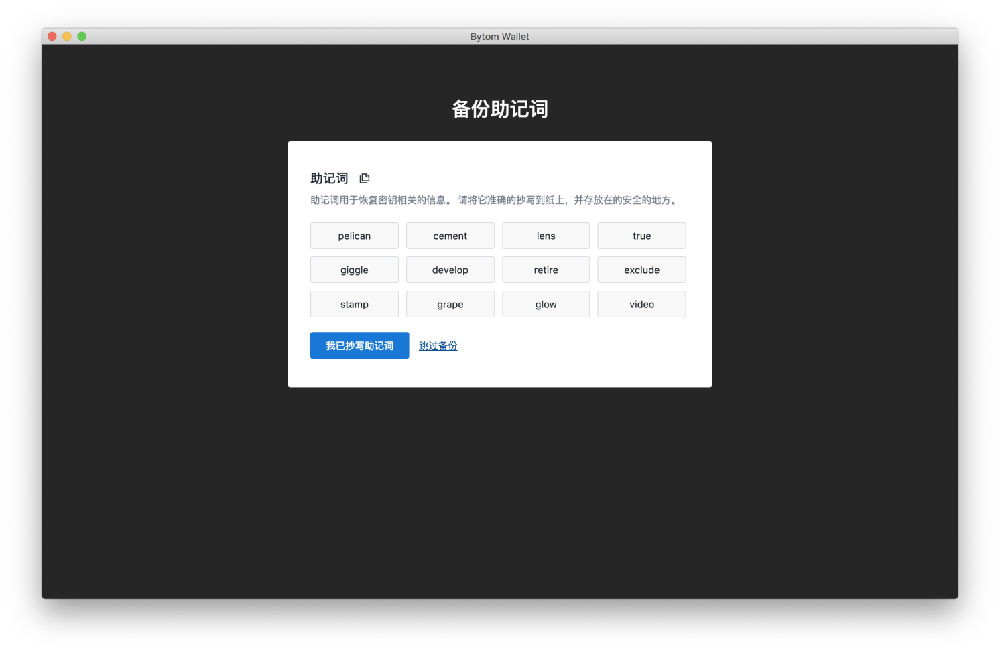

进入主界面：
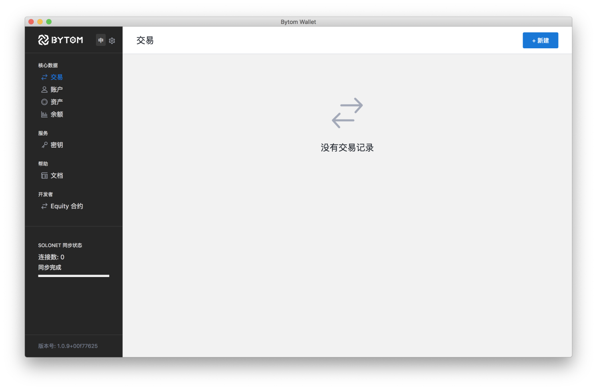

**简单使用**

点击左上角的设置可以查看核心状态，核心状态显示当前网络的基本信息，可以点击按钮开启挖矿：
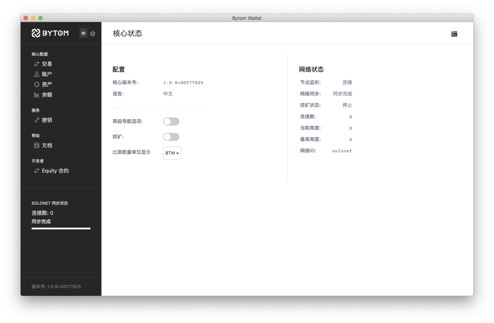

开启挖矿之后，在交易页面可以显示交易信息：
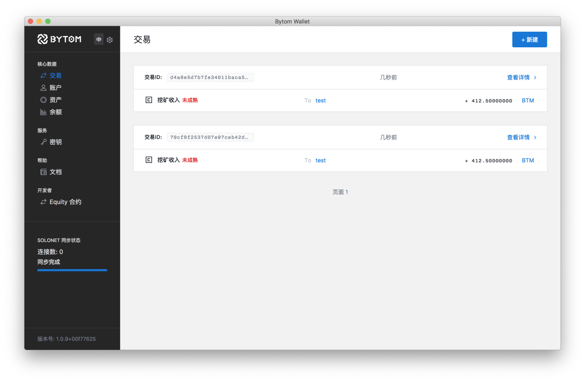

在账户页面显示账号信息：
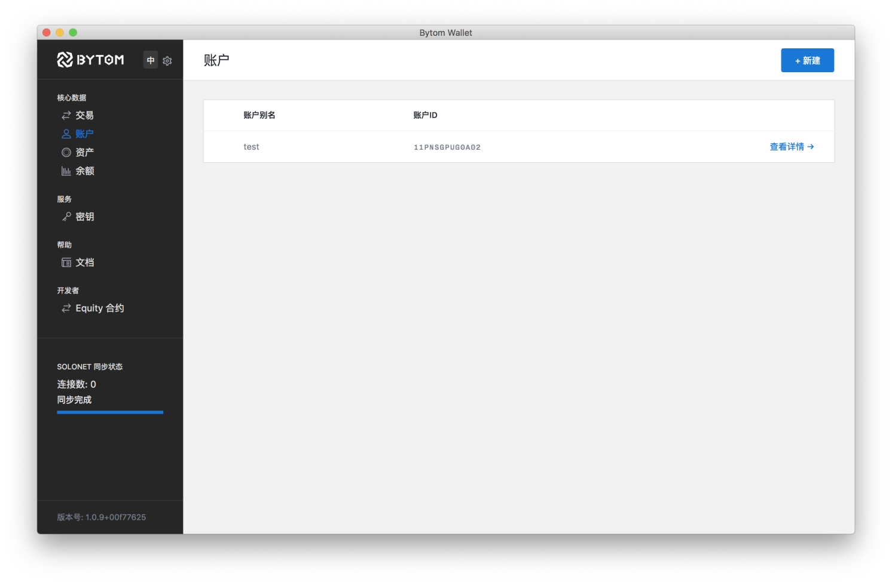

在资产页面显示资产信息：

在余额页面可以显示账户余额信息：
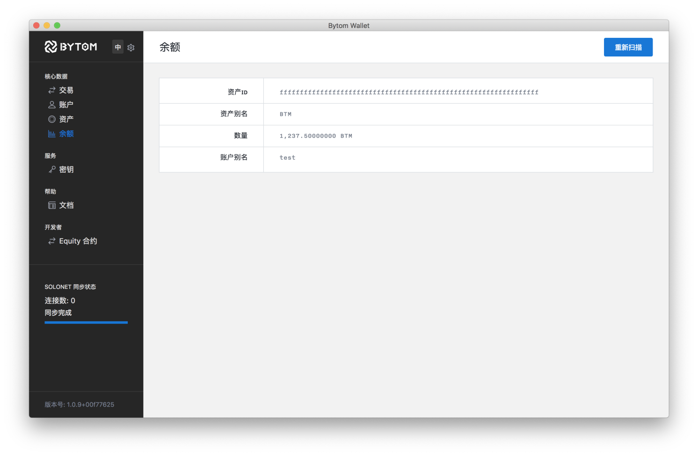

在密钥页面显示用户密钥信息：
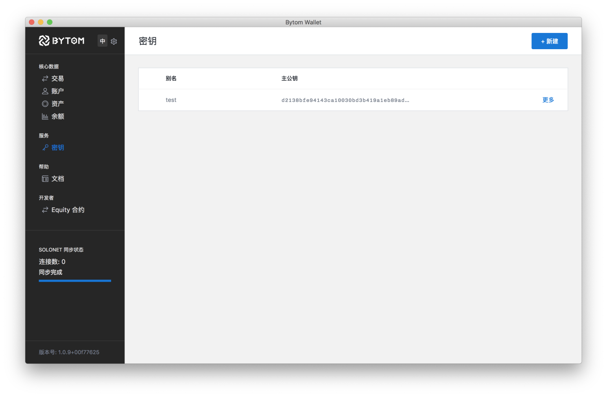

