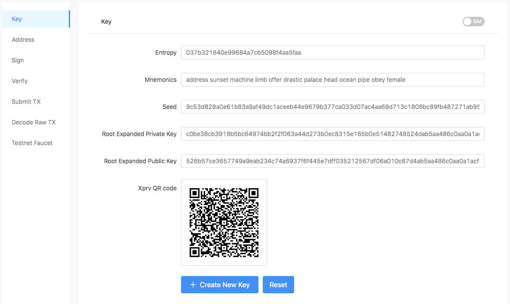
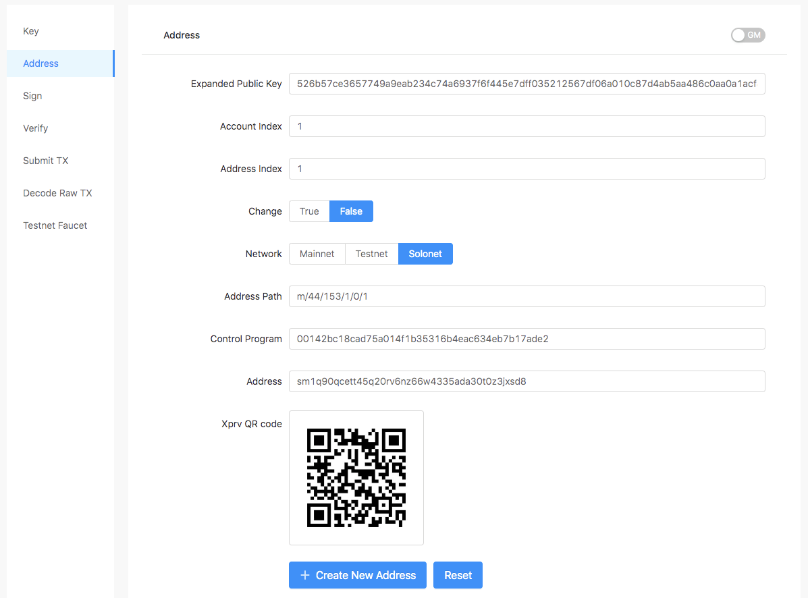
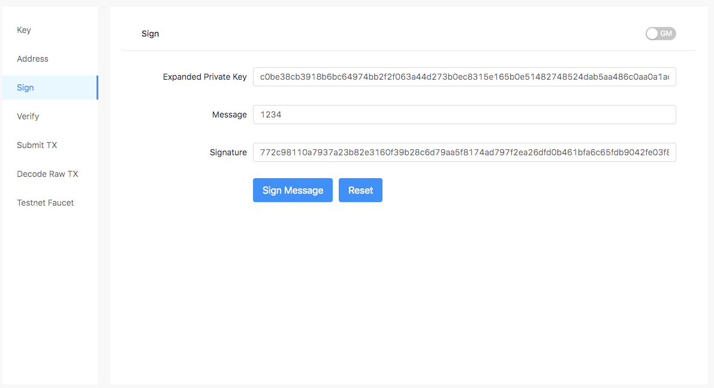
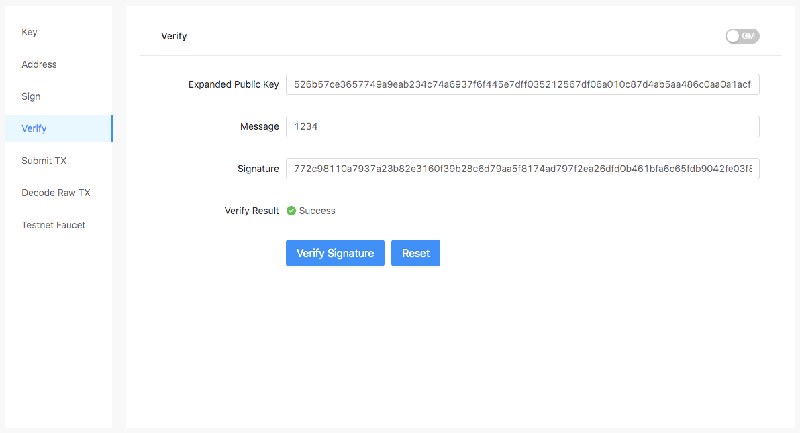
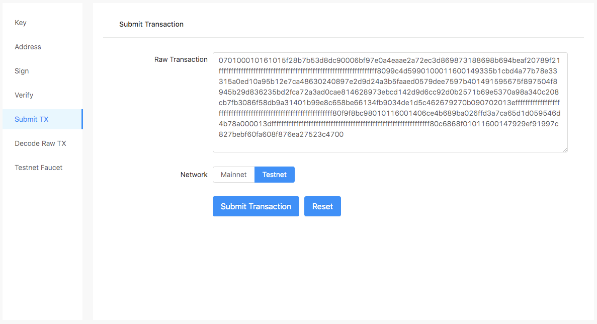
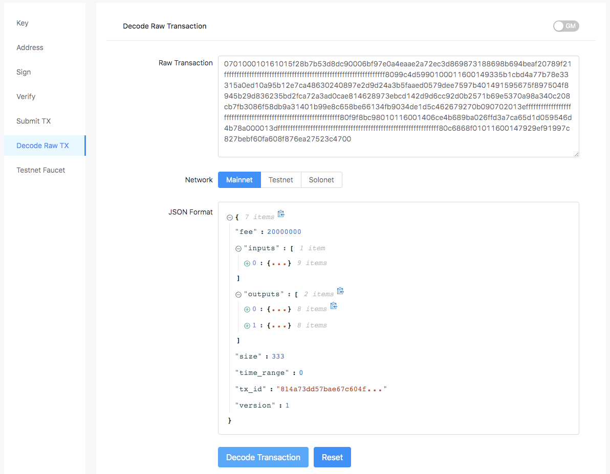
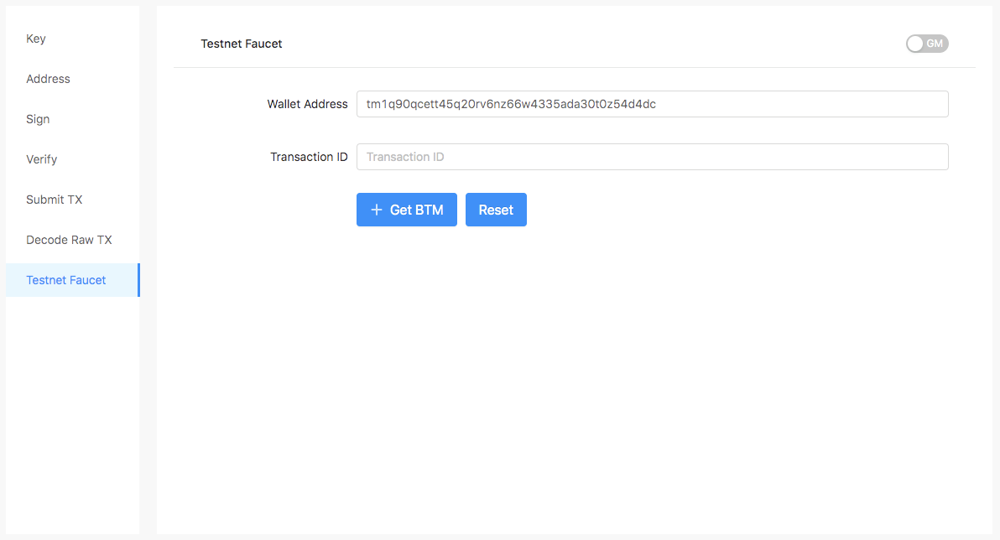

Bytom Kit是一款开发辅助工具，集合了校验、标注、解码、测试水龙头等功能。

##### 1.创建私钥 

网址: [https://blockmeta.com/tools/key](https://blockmeta.com/tools/key)

##### 2. 创建地址

网址: [https://blockmeta.com/tools/address](https://blockmeta.com/tools/address)

##### 3. 签名

地址: [https://blockmeta.com/tools/sign](https://blockmeta.com/tools/sign)

##### 4. 验签

地址: [https://blockmeta.com/tools/verify](https://blockmeta.com/tools/verify)

##### 5. 提交交易

地址: [https://blockmeta.com/tools/txs](https://blockmeta.com/tools/txs)

##### 6. 反序列化交易

地址: [https://blockmeta.com/tools/decode](https://blockmeta.com/tools/decode)

 
##### 7. 测试币水龙头

地址: [https://blockmeta.com/tools/faucet](https://blockmeta.com/tools/faucet)

