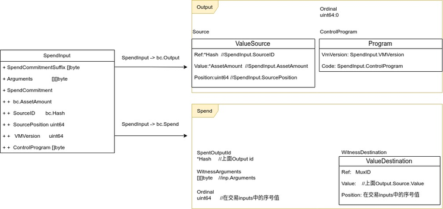
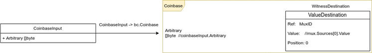
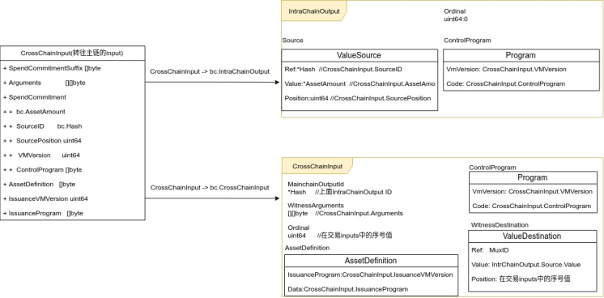
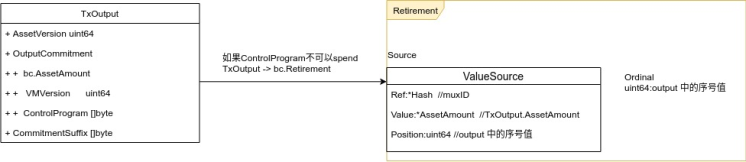
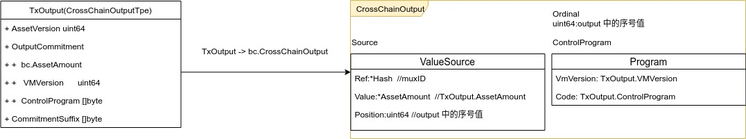
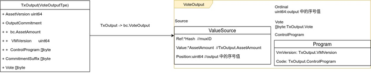

**交易数据**

Tx数据结构包含 TxData和bc.Tx。
```dart
// Tx holds a transaction along with its hash.
type Tx struct {
	TxData
	*bc.Tx `json:"-"`
}
```

TxData 是交易编码、存储使用的结构。
```go
// TxData encodes a transaction in the blockchain.
type TxData struct {
	Version        uint64
	SerializedSize uint64
	TimeRange      uint64
	Inputs         []*TxInput  //交易输入集
	Outputs        []*TxOutput //交易输出集
}

```
其中input 分为四种类型
```go
	CrossChainInputType   //跨链输入类型 
	SpendInputType        //普通spend类型
	CoinbaseInputType     //coinbase 奖励输入类型
	VetoInputType		  //取消投票输入类型
```

output 分为三种类型
```go
	IntraChainOutputType //同一条链普通输出
	CrossChainOutputType //跨链输出类型
	VoteOutputType 		 //投票输出类型

```

bc.Tx 是把inputs、outpus结构的TxData转换为entries-based的交易结构，主要用来进行交易验证。
```go
// Tx is a wrapper for the entries-based representation of a transaction.
type Tx struct {
	*TxHeader		
	ID       Hash			  //header entryID
	Entries  map[Hash]Entry   //TxData inputs/outputs对应的entries集合
	InputIDs []Hash 		  //TxData.Inputs 对应的 entryID

	SpentOutputIDs     []Hash  //SpendInput的Output entryID
	MainchainOutputIDs []Hash  
	GasInputIDs        []Hash  //btm spend 和 coinbase 的entryID
}
```

**TxData -> bc.Tx 转换**

为了进行交易验证，每一种input类型、output类型都会转换为相应的entry。

**input 类型转换**

- spendInput 为普通spend类型input ，会转换成bc.output 和 bc.Spend 两个entries。



- coinbase 为区块奖励类型input ，会转换成bc.Coinbase类型entry。



- CrossChainInput为转往主链的input ，会转换成bc.IntraChainOutput 和 bc.CrossChainInput两个entries。



- VetoInput 为取消投票的input ，会转换成bc.VoteOutput 和 bc.vetoInput两个entries。


**output 类型转换**

- 如果TxOutput的control program为不可以花费类型，则会转换为Retirement entry。



- IntraChainOutputType类型为当前链的普通输出类型，会转换为IntraChainOutput entry。


- CrossChainOutputType类型为转到主链上的utxo，会转换为CrossChainOutput entry。



- VoteOutputType类型为投票输出，会转换为VoteOutput类型。



**基于mux的交易验证**

交易验证对转换后bc.Tx进行验证，bc.Tx的基于entry形式。验证时从header开始，沿着上面的图从右侧向左对各组件进行依次验证，每一种组件有单独的验证规则。其中mux entry作用是用来连接输入entries和输出entries，验证输入和输出的资产是否匹配。
由于各组件都实现了Entry接口，所以可以使用同一个函数对所有的组件进行验证。

```go
验证各组件的函数入口
func checkValid(vs *validationState, e bc.Entry) (err error)
```


