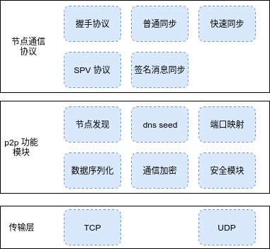

#### 节点通信架构



节点通信架构
节点通信分为三层，传输层使用TCP UDP协议传输数据，P2P模块是P2P通信通用功能模块，通信协议层完成区块链节点间同步协议。

**节点获取网络节点流程**
节点启动后首先使用节点发现数据库去查找存储在本地节点发现路由表的节点链接，节点发现流程参考[节点发现](#8a3a526e)服务。如果节点发现路由表为空则通过dns seed服务获取种子节点。dns seed服务无法成功获取种子节点的情况下会使用配置文件中的seeds。

**节点握手流程**
节点启动后会主动去和其他节点建立连接，也会接收其它节点的连接请求。节点主动拨号的节点为（outbound peer）, 主动连接本节点的节点为（inbound peer），为了保证节点网络安全性，节点需要有inbound节点和outbound节点。节点连接过程中需要对通信信道进行加密并进行节点身份确认，流程参考[连接加密及身份确认](#1075f01d)。通协议层握手主要进行版本，网络类型检验，并传输节点当前状态。

**节点安全处理**
节点通过信用积分和黑名单机制来惩罚恶意节点，如果发现节点发送恶意区块，恶意交易，则会对信用积分进行累加，达到阈值后则将节点加入黑名单，并在1小时内禁止节点的连接请求。

**节点端口映射**
节点映射使用UPnP协议，当一个节点加入网络时私有网络中的主机使用的是内网 IP 地址，是无法被外网的节点直接访问的。必须借助 NAT 网关设备（本地路由器）把内网地址映射到网关的公网地址上。使用端口映射主要目的是增加整个网络的健壮性，使内网节点能够有更多的网络连接，增加节点网络稳定性。

**同步协议**
同步协议完成节点间的数据同步工作，包括交易同步，区块同步，pos签名信息传输，具体参考[同步协议](#024bd7ff-1)。

**代码结构**

p2p功能模块代码

     p2p
     ├── connection      主要负责节点间连接及加密连接通道建立。
     ├── discover        节点发现功能。
     │   ├── dht         基于udp的类Kademlia节点发现协议实现。  
     │   └── mdns        mdns局域网节点发现协议。
     ├── netutil         
     ├── security        安全模块，实现信用积分及黑名单机制。
     ├── signlib         使用的非对称加密算法库。        
     └── upnp            upnp端口映射协议实现。

**节点间同步协议实现**

     netsync
     ├── chainmgr         普通区块同步，快速同步，交易同步实现。
     ├── consensusmgr     pos共识消息同步实现。
     ├── messages         节点间通信消息格式定义。
     ├── peers            同步节点管理。

**P2P 网络通信**

p2p网络通信主要完成全网节点发现，区块、交易、共识信息的同步，主要包括如下两个功能栈，基于udp的节点发现协议，基于tcp/ip的同步协议。

#### 节点发现协议

**基于udp节点发现**

vapor实现了类Kademlia的DHT存储有关网络中vapor节点的信息。协议维护了节点路由表，节点路由表依据距离把网络中节点信息存储到表中不同的bucket中。

**节点ID及距离**

网络中每个节点都有一个唯一ID，节点第一次启动时会产生ED25519公私钥对，其中公钥作为节点的ID，长度32byte。

两个节点之间的**距离**是以下公式计算而来，所以节点之间的距离代表逻辑距离，而不是节点间的真实物理距离。

```go
distance(n₁, n₂) = keccak256(n₁) XOR keccak256(n₂)
```

**节点路由表**

| bucket index | node |
| :---: | :---: |
| k-bucket 0 | 距离[1,2) |
| k-bucket 1 | 距离[2,4) |
| k-bucket 2 | 距离[4,8) |
| ... | ... |
| k-bucket i | 距离 [2(i+1) |
| ... | ... |
| k-bucket 255 | 距离[2^255, 2^(255+1)) |


根据Kademilia协议节点需要保留其邻居节点的信息。邻居节点存储在由“k-buckets”组成的路由表中。对于每个bucket[i] `0≤i<256`，存储距离自己“2(i + 1)”之间的距离节点。

协议使用“k = 16”，即每个k-bucket最多存储16个节点。bucket中节点按上次查看的时间排序 - 最近看到的节点位于bucket头部，最先看到的在bucket尾部。

每当遇到新节点N1时，它就可以插入相应的桶中。如果桶中包含少于“k”的节点，则可以简单地将N1添加到桶头部。如果该桶已经包含`k`个节点，则取桶中最先看到的节点N2，需要通过发送ping数据包重新验证节点是否在线。如果没有从N2收到答复，那就是被认为是无效的，N2被移除bucket并且N1被添加到桶的前面。
否则将N2加入cache中，如果cache也满了，则把最先放入cache中的节点N3删除。当有节点掉线时则会把cache中的最新节点放入bucket中。

**路由表刷新**

节点通过定期迭代查找距离targetID距离近的节点来更新路由表。工作过程如下：

    a. 随机生成目标节点Id，记为TargetId，从1开始记录发现次数和刷新时间。
    b. 在当前节点的K桶里查找与目标节点最近的16个节点
    c. 向b中得到的每个节点发送findnode命令,接收到每个节点传回的neighbours节点
    d. 对c返回的每个节点进行ping-pong测试然后更新到本地k桶

如果一轮FindNode查询无法返回比已知最近的节点更近的节点，启动器将FindNode重新发送到k个最近节点中未查找过得节点。

**协议消息及编码**

协议实现了Kademlia协议的两组命令：

    ping<------------->pong 
    findnode <---------->neighbors

节点发现消息作为UDP数据报发送。数据包的最大大小为1280字节。

```
packet = packet-header || packet-data
```

每个数据包都以header开头：

```
packet-header = hash ||nodeID ||signature||packet-type
hash = sha3（nodeID || signature || packet-type || packet-data）
signature = sign（packet-type || packet-data）
```

_hash_ 字段使在同一个UDP端口上运行多个协议时可识别。

_packet-type_ 是定义消息类型。

**Ping Packet（0x01）**

```
packet-data = [version，from，to，expiration]
from = [sender-ip，sender-udp-port，sender-tcp-port]
to = [recipient-ip，recipient-udp-port，0]
```

_expiration_ 字段是绝对的UNIX时间戳。包含过去时间戳的数据包会因为过期而无法处理。
收到ping数据包后，收件人应使用pong数据包进行回复。

**Pong Packet（0x02）**

```
packet-data = [to，ping-hash，expiration]
```

Pong是对ping的回复。

_ping-hash_ 应该等于相应ping包的hash。应该忽略没有包含最新ping-hash的pong数据包，因为不是对最新ping消息做出的响应。

**FindNode Packet（0x03）**

```
packet-data = [target，expiration]
```

_FindNode_ 数据包请求接近target的节点的信息。收到FindNode后，收件人应回复_Neighbors_数据包，在其本地表中找到最接近target的16个节点并返回。

**Neighbors Packet（0x04）**

```
packet-data = [node，expiration]
nodes = [[ip，udp-port，tcp-port，node-id]，...]
```

Neighbors是对FindNode的回复。

**数据同步协议**

| Tx Sync/Block Sync/Fast Sync/Spv |
| :---: |
| Wire Protocol |
| Encryption |
| TCP/IP |


**基于tcp/ip同步协议**

数据同步首先会在节点之间建立连接_MConnection_，建立连接后会对连接进行加密处理，区块，交易数据序列化为二进制数据流通过加密通道传递给其它节点。

#### 建立加密连接

**建立多路复用连接**

_MConnection_ 是在单个tcp连接上支持多个独立流传输的多路复用连接，并且每个流提供了单独的服务质量保证。每个流称为_Channel_，每个_Channel_具有全局唯一的_ byte id _ 。每个_channel_也具有决定服务质量的相对优先级。_byte id_ 和每个Channel的相对优先级在初始化时配置。

MConnection支持三种数据包类型：

- Ping
- Pong
- Msg

**Ping和Pong**

ping和pong消息向连接写入单个字节;分别为0x1和0x2。

当我们在pingTimeout周期没有及时收到MConnection上的任何消息时，我们发送一条ping消息。
当在MConnection上收到ping消息时，会发送一个pong作为响应。如果在ping之后没有及时收到pong消息，则节点将断开连接。

**Msg**

通道中的消息被切割成较小的_msgPacket_ 以进行多路复用。

```
type msgPacket struct {
    ChannelID byte
    EOF       byte // 1 means message ends here.
    Bytes     []byte
}
```

`msgPacket`
用[go-wire](https://github.com/Bytom/bytom/tree/master/vendor/github.com/tendermint/go-wire)进行序列化，并以0x3为前缀。接收到的一组数据包的“字节”被附加在一起直到收到带有`EOF = 1` 的数据包，然后完整的序列化消息由相应_channel_的_onReceive_函数处理。

**多路复用**

消息从_sendRoutine_ 发送，它循环在select状态上并发送ping，pong或msg消息。该批数据消息可以包括来自多个_channel_的消息。消息字节排队等待在各自的通道中发送，每个通道一次取一个未发送的消息。从最近发送的字节与信道优先级的比最低的信道选择一个消息发送。

**发送消息**

发送消息有两种方法：

```
func (m MConnection) Send(chID byte, msg interface{}) bool {}
func (m MConnection) TrySend(chID byte, msg interface{}) bool {}
```

`Send（chID，msg）`是一个阻塞调用，等待_msg_成功排队到给定id字节_chID_的通道。消息_msg_被序列化使用_wire_子模块的`WriteBinary()`反射函数。`TrySend（chID，msg）`是一个非阻塞调用，它将消息_msg_排入_chID_通道如果队列未满;否则立即回_false_。`Send（）`和`TrySend（）`对每个_Peer_可见。

**Peer**

每个_peer_都有一个_MConnection_实例，并含有其他信息，例如是否是outbound(主动拨号其它节点)，关于节点的各种身份信息，以及reactor使用的其他更高级别的线程安全数据。

**Switch/Reactor**

_Switch_ 控制peer连接，以在Reactor上接收传入消息。每个Reactor负责处理一个或多个channel传入的信息。因此，通常通过peer发送消息，在Reactor上接收传入的消息。

新添加peer后，给定`reactor`的传入消息将通过该`reactor`的`Receive`方法处理，并且输出消息由每个节点的`Reactor`直接发送。 `reactor`使用节点之间的`go-routing`来处理这些。

**连接加密及身份确认**

在节点拨号成功后，执行两次握手：第一次进行通道加密、身份验证，第二次进行版本、网络类型验证。

**Peer Identity**

节点每次启动都会随机产生一个**public key**作为节点的**id**。当尝试连接到peer时，我们使用`PeerURL：<ID> @ <IP>：<PORT>`。我们将尝试连接_IP：PORT_上的节点，并验证身份，通过经过身份id的签名，只有拥有相应私钥的节点可以建立连接。这可以防止对节点的中间人攻击。

**通信加密、身份验证**

节点建立加密连接时使用**Diffie-Helman密钥交换协议**生成共享秘钥，使用**NACL SecretBox**对通信数据进行对称加密。
工作流程如下：

- 生成一个临时的ED25519密钥对
- 将临时的公钥发送给对等方
- 等待接收对等方的临时公钥
- 使用对方临时公钥和我们的临时私钥计算Diffie-Hellman共享密钥
- 生成两个用于加密（发送和接收）的随机数，流程如下：

        1.按升序对临时的公钥进行排序并将它们连接起来
        2.进行RIPEMD160运算
        3.附加4个空字节（将散列扩展为24个字节）
        4.结果是nonce1
        5.翻转nonce1的最后一位以获得nonce2
        6.如果我们有一个较小的临时pubkey，使用nonce1接收，nonce2发送;否则相反

- 从现在开始的所有通信都使用共享密钥和随机数进行加密，其中每个随机数每次使用时增加2
- 我们现在有一个加密通道，但仍需要进行身份验证
- 签名共同挑战：

        1.对排序和连接的短暂pubkey进行SHA256运算
        2.使用我们的持久私钥签署共同挑战
        3.将go-wire编码的持久性pubkey和签名发送给节点
        4.等待从节点接收持久公钥和签名
        5.使用节点的持久公钥验证消息签名

如果这是一个outgoing连接（主动连接其它节点）并且使用了节点ID，然后最后验证节点的持久公钥是否与我们拨号的节点ID相对应，即。 `peer.PubKey.Address() == <ID>`。

现在连接现已通过身份验证，并且所有流量都已加密。

**注意**：只有拨号节点可以验证节点的身份，但这是我们关心的，因为当我们加入网络时我们希望确保已经连接了目标节点（而不是被中间人攻击）。

**版本确认**

版本确认允许节点交换其NodeInfo：

```go
type NodeInfo struct {
	PubKey  string
	Moniker string
	Network string
	NetworkID   uint64
	RemoteAddr  string
	ListenAddr  string
	Version     string
	ServiceFlag consensus.ServiceFlag `json:"service_flag"`
	Other []string `json:"other"`
}
```

如果出现以下情况则断开连接：

- `peer.NodeInfo.Version` 未格式化为`X-X-X`，其中X是称为Major，Minor和Revision的整数。
- `peer.NodeInfo.Version` 主版本号与我们的不一样。
- `peer.NodeInfo.Network` 网络类型与我们的不一样。

`service_flag` 代表节点支持的服务。

```
// 全节点标志
SFFullNode ServiceFlag 0x1 
// 快速同步标志       
SFFastSync             0x2
```

此时，如果没有断开连接，则节点有效。它通过`AddPeer`方法添加到`switch`中，因此被添加到所有`reactor`中。

#### 数据序列化协议

**支持的类型**

原始类型

  - `uint8` (aka `byte`), `uint16`, `uint32`, `uint64`
  - `int8`, `int16`, `int32`, `int64`
  - `uint`, `int`: variable length (un)signed integers
  - `string`, `[]byte`
  - `time`

派生类型

  - structs
  - 特定类型的变长数组
  - 特定类型的固定长度数组
  - interfaces：注册的联合类型，前面是`type byte`
  - 指针

**二进制编码**

**固定长度基本类型** 用1,2,3或4个大端字节编码。

   - `uint8`（又名`byte`），`uint16`，`uint32`，`uint64`：分别占用1,2,3和4个字节
   - `int8`，`int16`，`int32`，`int64`：分别占用1,2,3和4个字节
   - `time`：`int64` 表示自纪元以来的纳秒

**可变长度整数** 用一个前导字节编码，表示后续大端字节的长度。对于有符号的负整数，前导字节的最高有效位为1。

   - `uint`：1字节长度前缀可变大小（0~255字节）无符号整数
   - `int`：1字节长度前缀变量大小（0~127字节）有符号整数

注意：虽然数字0（零）用单个字节`x00`编码，但数字1用两个字节表示：`x0101`。这不是最高效的表示，但规则更容易记住。

| 号码 | 二进制`uint` | 二进制`int` |
| --- | --- | --- |
| 0 | `x00` | `x00` |
| 1 | `x0101` | `x0101` |
| 2 | `x0102` | `x0102` |
| 256 | `x020100` | `x020100` |
| 2 ^（127 * 8）-1 | `x7FFFFF ...` | `x7FFFFF ...` |
| 2 ^（127 * 8） | `x800100 ......` | 溢出 |
| 2 ^（255 * 8）-1 | `xFFFFFF ...` | 溢出 |
| -1 | 不适用 | `x8101` |
| -2 | 不适用 | `x8102` |
| -256 | 不适用 | `x820100` |


**Structures** 通过按声明顺序对字段值进行编码来编码。

```go
type Foo struct {
    MyString string
    MyUint32 uint32
}
var foo = Foo {“626172”，math.MaxUint32}
  foo的二进制表示：
  0103626172FFFFFFFF
  0103：`int`编码的字符串长度，这里是3
  626172：3个字节的字符串“bar”
  FFFFFFFF：uint32 MaxUint32的4个字节
```

**可变长度数组** 用前导“int”编码，表示数组的长度，后跟项目的二进制表示。 **固定长度数组** 类似，但前面没有前导`int`。

```go
foos：= [] Foo {foo，foo}
foos的二进制表示：
  01020103626172FFFFFFFF0103626172FFFFFFFF
  0102：`int`编码的数组长度，这里2
  0103626172FFFFFFFF：第一个`foo`
  0103626172FFFFFFFF：第二个`foo`
foos：= [2] Foo {foo，foo} //固定长度数组
foos的二进制表示：
  0103626172FFFFFFFF0103626172FFFFFFFF
  0103626172FFFFFFFF：第一个`foo`
  0103626172FFFFFFFF：第二个`foo`
```

**接口** 可以代表任意数量的具体类型之一。必须首先使用相应的`type byte`声明接口的具体类型。然后使用前导“类型字节”对接口进行编码，然后对底层具体类型进行二进制编码。

注意：字节`x00`保留用于`nil`接口值和`nil`指针值。

```go
type Animal interface{}
type Dog uint32
type Cat string

RegisterInterface（
  struct{ Animal }{},          // Convenience for referencing the 'Animal' interface
  ConcreteType{Dog(0),  0x01}, // Register the byte 0x01 to denote a Dog
  ConcreteType{Cat(""), 0x02}, // Register the byte 0x02 to denote a Cat
）

var animal Animal = Dog（02）
The binary representation of animal:
  010102
  01:   the type byte for a `Dog`
  0102: the bytes of Dog(02)
```

**指针** 用一个前导字节`x00`编码为`nil`指针，否则用前导字节`x01`编码，然后是指向的值的二进制编码。

**注意**：将指针类型转换为接口类型很容易，因为`type byte` `x00`总是`nil`。

**JSON编码**

JSON编解码器与[`binary`]（#binary）编解码器兼容，如果您已经熟悉golang的JSON编码，则相当直观。下面提到了一些特殊规定：

- 可变长度和固定长度字节编码为大写十六进制字符串
- 接口值被编码为两个项的数组：`[type_byte，concrete_value]`
- 次数被编码为rfc2822字符串

#### 同步协议

vapor 目前支持普通同步模式，快速同步模式，共识消息传输。

| Normal | Fast Sync | Consensus |
| :---: | :---: | :---: |
| BlockMessage | HeadersMessage | BlockProposeMsg |
| StatusMessage | BlocksMessage | BlockSignatureMsg |
| TransationMessage |  |  |


**节点协议握手**

节点协议握手首先会向对方发送状态信息，同时通过状态信息获取对方当前状态，同步协议在获取状态之后。

**StatusRequestMessage**

| Bytes | Name | Data Type | Description |
| :---: | :---: | :---: | :---: |
| 0 | null |  | 消息体为空，用于向对方获取状态信息 |


**StatusResponseMessage**

| Bytes | Name | Data Type | Description |
| :---: | :---: | :---: | :---: |
| 8byte | Height | uint64 | 当前本地高度 |
| 32byte | RawHash | [32]byte | 当前最高区块hash |
| 8byte | IrreversibleHeight | uint64 | 不可逆区块高度 |
| 32byte | IrreversibleHash | [32]byte | 不可逆区块hash |


在握手后会进行交易池同步，交易池同步会把当前池中的交易打包发给对方，发送交易使用_TransactionsMessage_。

**TransactionsMessage**

| Bytes | Name | Data Type | Description |
| :---: | :---: | :---: | :---: |
| Varies | RawTxs | [][]byte | 交易消息 |


**同步协议**

目前支持普通同步和快速同步两种模式，区块同步程序定时检查所有连接的节点状态，判断是否需要同步，当需要同步时，判断节点满足快速同步条件时则进行快速同步，否则进行普通同步。为了使提议区块能快速同步到全网，当收到提议区块时会触发同步流程，使新区块快速上链，并及时更新提议区块高度，从而减少孤儿块产生的概率。同步协议同时负责新提议区块的传输及签名信息传输。

**普通同步模式**

当节点高度和全网高度差在一定范围内则进行普通同步。普通同步模式下，节点按高度获取高度并进行全区块验证。使用_GetBlockMessage_和_BlockMessage_消息获取区块。

**GetBlockMessage**

| Bytes | Name | Data Type | Description |
| :---: | :---: | :---: | :---: |
| 8byte | Height | uint64 | 使用高度获取区块，如果高度为0，则使用hash获取区块 |
| 4byte | RawHash | [32]byte | 使用hash获取区块 |


**BlockMessage**

| Bytes | Name | Data Type | Description |
| :---: | :---: | :---: | :---: |
| Varies | RawBlock | []byte | 序列化的区块信息 |


**快速同步模式**

当节点高度和全网高度差超过一定范围则进行快速同步。快速同步模式下，节点向多个节点并发获取区块头以及区块，可以极大提高同步速度。

**GetHeadersMessage**

| Bytes | Name | Data Type | Description |
| :---: | :---: | :---: | :---: |
| Varies | RawBlockLocator | [][32]byte | 区块头定位器，用于定位获取区块头的开始位置 |
| 32 byte | RawStopHash | [32]byte | 用于定位获取区块头结束的位置。 |


**HeadersMessage**

| Bytes | Name | Data Type | Description |
| :---: | :---: | :---: | :---: |
| Varies | HeadersMessage | [][]byte | 打包的区块头信息 |


**GetBlocksMessage**

| Bytes | Name | Data Type | Description |
| :---: | :---: | :---: | :---: |
| Varies | RawBlockLocator | [][32]byte | 区块定位器，用于定位获取区块的开始位置 |
| 32 byte | RawStopHash | [32]byte | 用于定位获取区块结束的位置。 |


**BlocksMessage**

| Bytes | Name | Data Type | Description |
| :---: | :---: | :---: | :---: |
| Varies | RawBlocks | [][]byte | 打包的区块信息 |


**共识消息传输**

提议区块及签名消息也需要在节点间同步。

**BlockProposeMsg**

| Bytes | Name | Data Type | Description |
| :---: | :---: | :---: | :---: |
| Varies | RawBlock | []byte | 序列化的提议区块信息 |


**BlockSignatureMsg**

| Bytes | Name | Data Type | Description |
| :---: | :---: | :---: | :---: |
| Varies | BlockHash | [32]byte | 区块hash |
| Varies | Signature | []byte | 签名信息 |
| Varies | PubKey | []byte | 公钥信息 |


