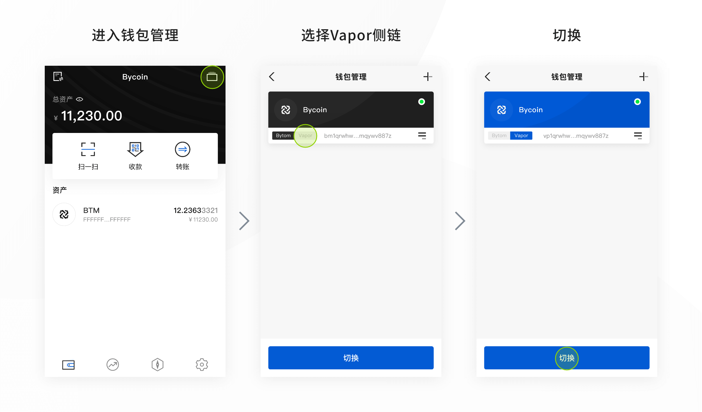
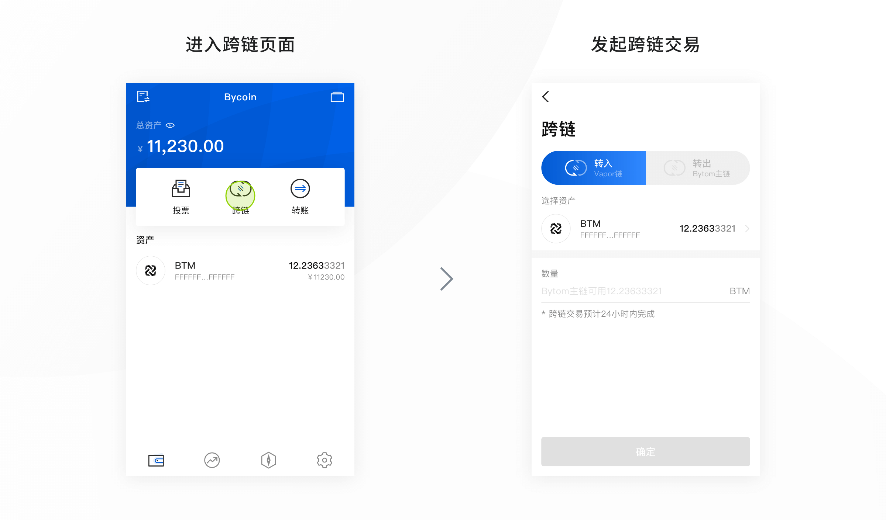
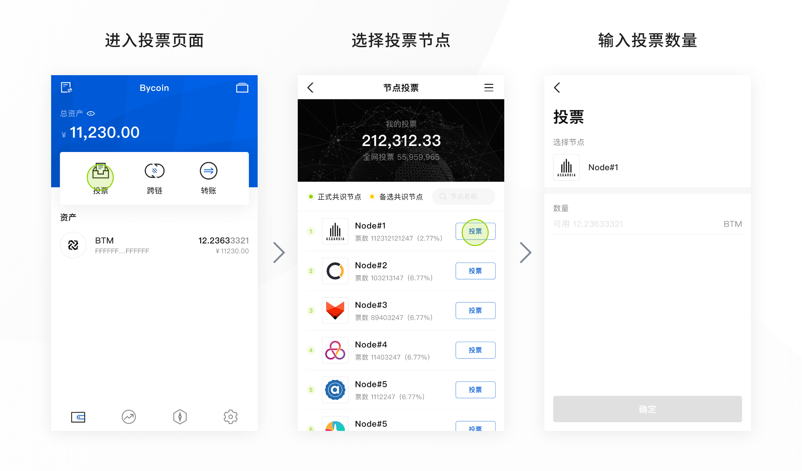
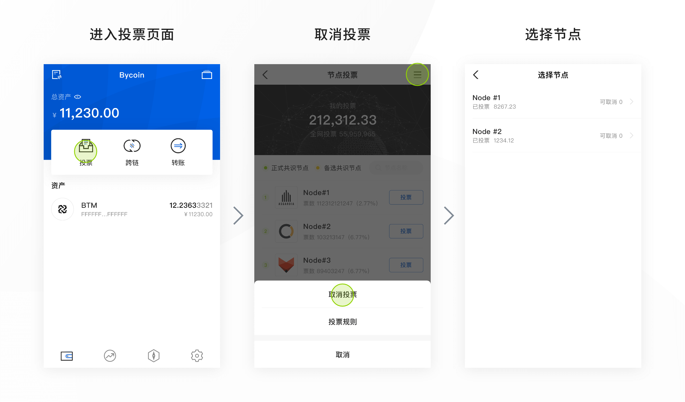
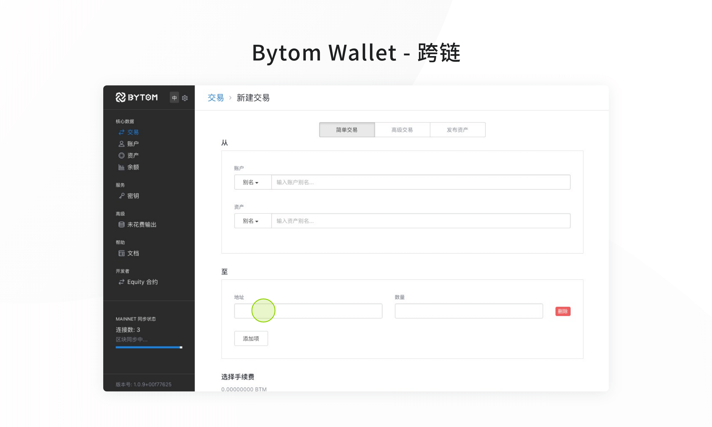
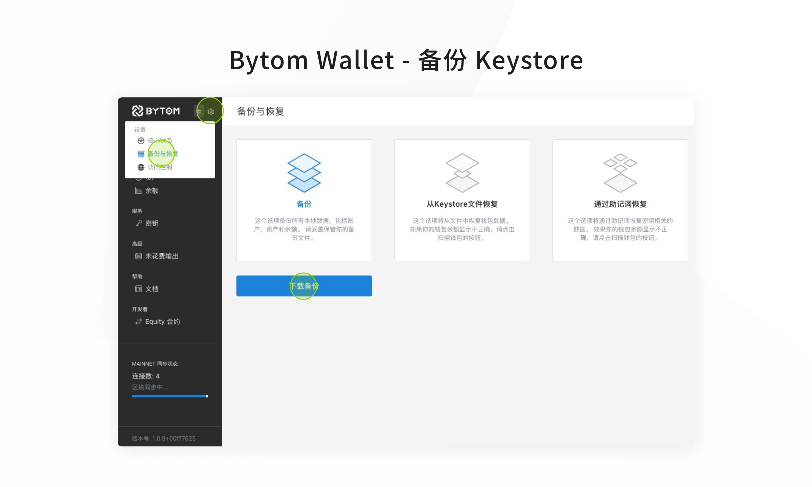
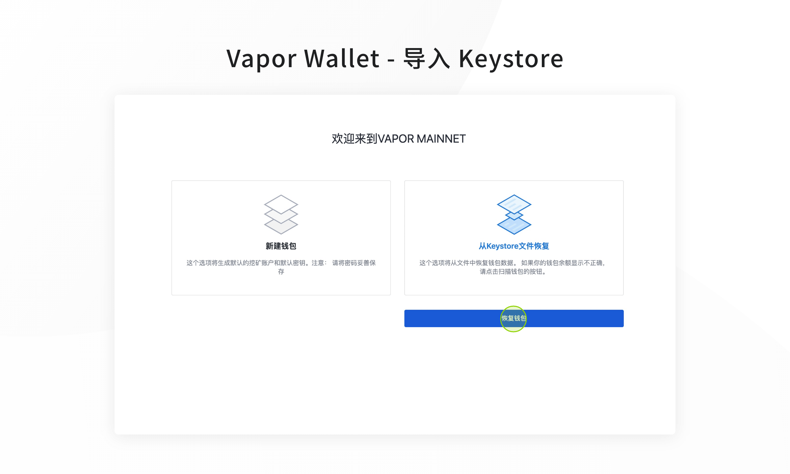
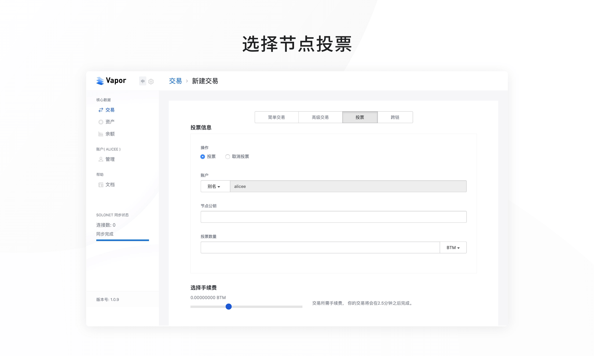

节点投票是选举出侧链的共识节点，共识节点负责交易打包到区块，生产区块。侧链上持有BTM的用户投票给节点，每轮共识根据节点获得的投票数，筛选前10个节点作为共识节点。用户投票成功，账户相应数量的BTM锁定20天不能进行任何交易行为。20天后用户可以取消投票，可立即交易。投票用户根据被投票节点的收益分配规则获取对应收益。

**一. 进行投票**

【推荐】Bycoin App（v1.2.0）[【下载链接】](https://bycoin.im/)

**1、切换至侧链：钱包管理->切换Vapor侧链**

**2、BTM资产转移至侧链：跨链->选择转入Vapor侧链**

- *跨链需要少量手续费（小于0.01BTM），跨链交易预计24小时内完成，请耐心等待

**3、正式投票：投票->选择节点投票->投票成功**

- *投票需要少量手续费（小于0.01BTM），用于投票的BTM资产将会锁定在Vapor侧链钱包，20天后可以进行赎回
- *由于跨链和正式投票需要少量手续费，正式投票与早鸟投票数量允许1 BTM以内误差

**4、取消投票：投票->取消投票->选择节点**

- 用户取消部分投票时，未取消部分投票会重新进行投票
- 并锁定20天。

Bytom/Vapor Wallet for Desktop[【Vapor下载】](https://github.com/Bytom/vapor/releases/tag/v1.0.0)[【Bytom下载】](https://github.com/Bytom/bytom/releases)

**1、BTM资产转移至侧链：使用Bytom钱包转账至联邦地址**

**2、切换至侧链：使用Vapor钱包导入Keystore（原Bytom钱包Keystore）**

**3、正式投票：使用Vapor钱包投票**

**二. 注意事项**

- 1. 正式投票期间，用于投票BTM资产将会锁定在侧链钱包，20天后可以进行赎回。

最终解释权归比原基金会所有
