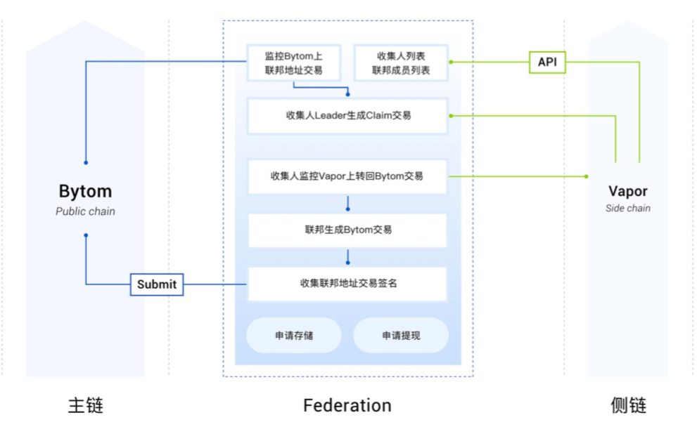

**以下是Federation基本的模型图：**

**Vapor 侧链充值:**
资产从主链转移到侧链的过程，需要资产先锁定到联邦（Federation）合约地址，然后在侧链流通和使用。

**Vapor 侧链提现:**
Vapor 侧链用户发起提现请求，销毁 Vapor 侧链的资产。联邦合约地址针对请求向 Vapor 侧链用户的主链地址发送对应对应数量的资产。

**Federation ** 成员由社区成员选举组成，密钥分布式管理，实现去中心化。跨链交易必须验证为经过 federation 签名。

